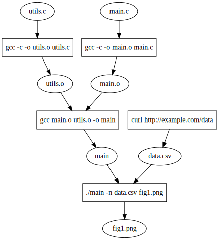

# Automatic Reproducibility for Science

## Motivation

I
- Trust in science comes from independent reproduction of results
- Science is an inherently communal effort

II
- During the COVID pandemic, epidemiological simulations done by Neil Ferguson (Imperial College) showed that lockdowns could significantly reduce the death toll.
- This simulation was not made easilly available for a number of reasons, one of which was the software would be onerous to run on any other system.
- This, among other issues, reduced public confidence in the simulations

III
- In theory, computational experiments should be much easier to reproduce than physical experiments (basically automatic)
- Modern tools solve "software environment portability" in theory, like portability libraries, Nix, VMs
- But even so, it is not easy for other scientists to reproduce simulations
- The tools still require expensive "interventions"
- No incentive to follow interventions, especially in the highly-competetive nature of modern academia
- Seek more "automatic" methods, require less and less intervention

## Vision

- Just run code normally, and we'll create a reproducible version
- Computational provenance := process and inputs used to generate a specific output
  - Disjoint graph between Processes and files
  - Recursive
  - 
  - [`./count.sh`](https://github.com/VIDA-NYU/reprozip-examples/blob/master/bash-count/count.sh)
  - 
- Capture system calls that manipulate file system or process-tree
  - Tradeoff between granularity and overhead
  - Don't necessarily need to capture read/write (very many of these!) just need to capture open-for-reading and open-for-writing
- Example applications
  - Send script to reproduce experiment
  - Script can use incremental computation
  - Could generate package specification
  - Create dataflow graph of process

## Solutions

- Kernel mods
  - [Example: PASS](https://www.usenix.org/legacy/events/usenix06/tech/full_papers/muniswamy-reddy/muniswamy-reddy.pdf)
  - [Example: PASSv2](https://www.usenix.org/legacy/events/usenix09/tech/full_papers/muniswamy-reddy/muniswamy-reddy.pdf)
  - Pro: Kernel is never wrong
  - Con: High maintenance cost/risky attack surface
- Linux Security Modules
  - [LSM on kernel.org](https://www.kernel.org/doc/html/latest/admin-guide/LSM/index.html)
  - [Example of LSM on Kernel.org docs](https://docs.kernel.org/core-api/kernel-api.html#c.security_inode_permission)
  - [Example: Camflow](https://camflow.org/)
  - Pro: Some structure as opposed to arbitrary kernel modules
  - Pro: LSMs are stackable
  - Con: Medium maintenance/risky attack surface
- Auditd
  - [Auditd on Archwiki](https://wiki.archlinux.org/title/Audit_framework)
  - [SPADE+Audit](https://github.com/ashish-gehani/SPADE)
  - Boot param `CONFIG_AUDIT=y` in `/boot/config*`
  - Kernel cmd arg `audit=1` in `/proc/cmdline` or `/etc/default/grub`
  - Pro: Low-overhead, kernel-supported
  - Con: Requires kernel args
- eBPF
  - Problem: 
  - `sudo $(which bpftrace) -e 'tracepoint:syscalls:sys_enter_openat { printf("%s opens %s\n", comm, str(args.filename)); }'`
  - Pro: Lowish-overhead
  - Con: Captures everyone/requires root
- ptrace
  - [ptrace(2) man page](https://man7.org/linux/man-pages/man2/ptrace.2.html)
  - [ptrace example](https://blog.tartanllama.xyz/writing-a-linux-debugger-setup/)
  - Example: `strace`
  - Example: `rr`
  - Pro: User-level!
  - Con: Very slow
  - Con: Bypassable (don't care)
- FUSE
  - [Perf overhead study](https://dl.acm.org/doi/fullHtml/10.1145/3310148)
  - Example: [SPADE+FUSE](https://github.com/ashish-gehani/SPADE/wiki/Limiting-filesystem-provenance-collection-on-Linux)
  - Pro: medium slow
  - Con: Only FS
- LD_PRELOAD
  - Incomplete
  - Example: [OPUS](https://www.usenix.org/conference/tapp13/technical-sessions/presentation/balakrishnan)

### Performance smackdown

- 
- 

## Futher issues

### Handling distributed computation

- Each node does provenance tracing locally
- "Stitch" provenance graphs together after the fact
- [PASSv2](https://www.usenix.org/legacy/events/usenix09/tech/full_papers/muniswamy-reddy/muniswamy-reddy.pdf) features stitching provenance across "layers"

### Manging storage

- Refer to package repositories where possible
- Long term archival storage issue
  - Backup in SWH
- Dedup across repository of executions
  - [Example: Reprozip](https://www.reprozip.org/)
- Prune provenance based on what is not overwritten
- Ideally, small enough to store for free in GitHub

### Granularity issues and provenance explosion

- Finer granularity => greater runtime and storage cost but more precise incremental computation
- Coarser granularity => lower runtme and storage cost but incremental computation can be imprecise
- [BEEP](https://www.ndss-symposium.org/wp-content/uploads/2017/09/03_1_0.pdf) describes problem and solution
