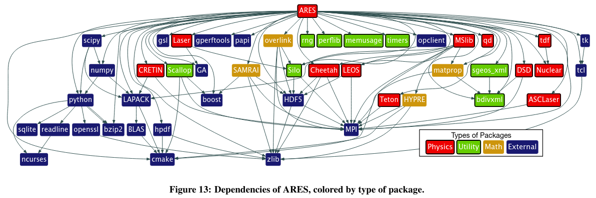
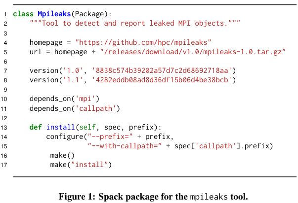
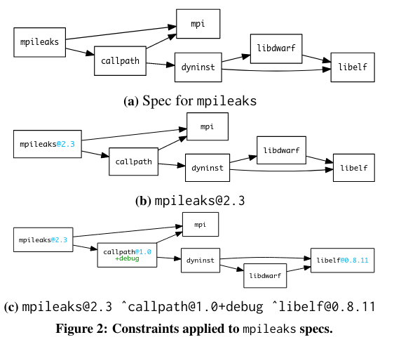
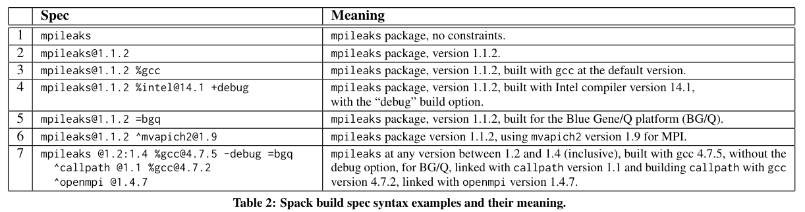
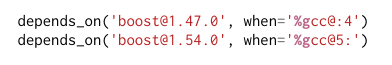
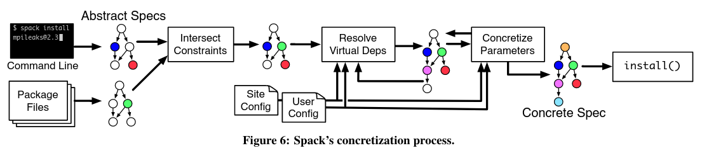
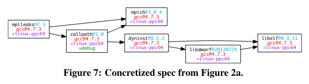

Compile me with:

```
pandoc --standalone --to=revealjs --output=README.html README.md
```

---

## Definition

A package manager is a program that can install, update, and remove other programs

## Axes of differentiation

- Binary or from source
  - If from source: reproducible, locally optimized, or neither
  - If from source: binary cache or not
- Requires superuser or not
- Supports multiple environments or not
- Resolves dependency versions or single consistent version

## Spack

## Requirements for HPC systems

- Manage extremely complex package dependencies
  - Need multiple versions of the same package installed at once
- Automate the build process of packages
- Install multiple complex pieces of software at once
  - Cope with combinatorial versioning

##



## Spack's Key Innovations

- Composable package descriptions
  - Packages are described parametrically
  - Same idea as templates in C++ or generics in Rust
- Spec syntax for specifying depedency graphs and constraints
- A concretization process to stamp out a concrete build specification

## Package descriptions

- Embedded DSL inside Python
- Parameterized via the `spec` argument of the `install` method



## Spack Specs

- Specification on an install supplied after `spack install`
  - Small enough usually to be a command line parameter
  
##



##




## Concretization

1. Spack intersects the DAG from the user's specs and another DAG created from directives in the package files
  - There may be conflicts if the user inadvertedly requests two versions of the same package, for example
2. Resolve virtual dependencies into normal dependencies
  - Select a particular implementation of MPI, BLAS, etc.
3. Greedily select concrete versions of packages until entire DAG is concrete
  - NOTE: this is all from their 2015 paper - "We leave automatic constraint space exploration for future work."

##



