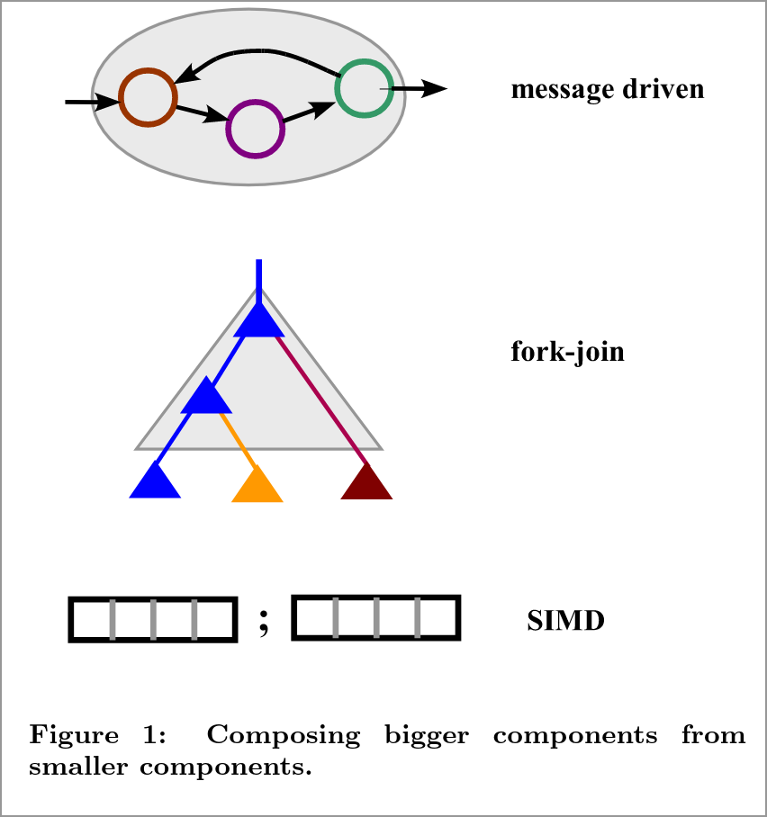
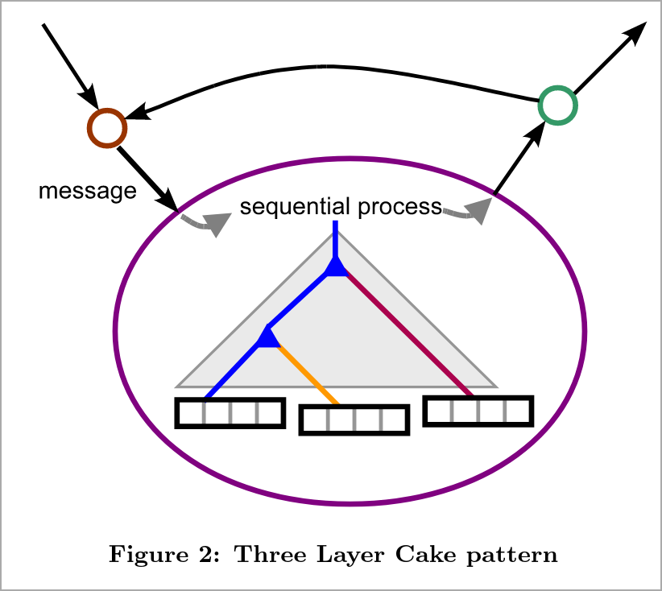

## How to compile

Compile me with:

```
pandoc --standalone --to=revealjs --output=README.html README.md --slide-level=2
```

## Objectives

- Mostly OS primitives
- A few programming models
- When to use each?
- Take only 35 mins

## What are processes?

::: {.incremental}

- How to launch processes?
- `fork()`
- → `clone()` [A fork in the road](https://dl.acm.org/doi/abs/10.1145/3317550.3321435)

:::

## Two paradigms

- Explicit == message passing
- Implicit == ? [shared memory]{.fragment}

## Shared memory in Linux

::: {.incremental}

- Use threads
- Mmapped file
- POSIX shared memory
  - [man shm_overview](https://www.man7.org/linux/man-pages/man7/shm_overview.7.html)
- Sys V shared memory
  - [man sysvipc](https://man7.org/linux/man-pages/man7/sysvipc.7.html)

:::


## Details on POSIX shm

- Mmapped file: `open`, `mmap`, ..., `munmap`, `close`
- Incurs I/O overhead eventually

## Details on POSIX shm

- `shm_open`, `ftruncate`, `mmap`, ..., `munmap`, `close`, `shm_unlink`
- /dev/shm
- [Real world ex in fsatrace](https://github.com/jacereda/fsatrace/blob/c031f8dae8f5456173157b3696f1c10f3c3c5b4a/src/unix/shm.c#L29)

## How does POSIX shared memory work?


[What about threads?]{.fragment}

## Concerns

::: {.incremental}

- Both threads and POSIX shm
  - Race conditions!
    - Synchronization
- POSIX shm
  - Shm could mmapped to different address!
    - Wrong: `*p = target;`Right: `*p = target - baseaddr;`
  - Globally unique keys?
  - Pointers may be pointing outside of shm

:::

## Msg Passing

::: {.incremental}

- Pipes
  - [man pipe](https://man7.org/linux/man-pages/man7/pipe.7.html)
- FIFOs (aka "named pipes")
  - [man mkfifo](https://man7.org/linux/man-pages/man3/mkfifo.3.html)
- Socket (UNIX, TCP, UDP)
  - [man socket(7)](https://man7.org/linux/man-pages/man7/socket.7.html)
- POSIX message queue
  - [man mq_overview](https://man7.org/linux/man-pages/man7/mq_overview.7.html)
- Sys V message queue
  - [man sysvipc](https://man7.org/linux/man-pages/man7/sysvipc.7.html)
:::

## Pipes/FIFOs

- Pipes: `pipe()` and `fork()` (inherit fds)
  - Must be "related" procs
  - Each proc must close one end!
  - [Real world ex in benchexec](https://github.com/sosy-lab/benchexec/blob/64d73c47e05a1487727c4777e23863ce4ed4851a/benchexec/containerexecutor.py#L605)
- FIFOs: `mkfifo(name)`
  - Uses normal POSIX FS
  - [Real world ex in Zsh](https://github.com/zsh-users/zsh/blob/49c6978dbbb717847344e7cef99e4ee26f56d234/Src/exec.c#L5033)

## Pipes in your shell


## Pipes/FIFOs

::: {.incremental}

- Sequential (unlike random-access mmap)
- Single producer, single consumer
- Finite capacity
  - Why?
  - Backpressure
- Blocking/non-blocking
- Versus file?

:::

## POSIX MQ

- `mq_open()`, `mq_send()/mq_recv()`, `mq_unlink()`
- Sequential
- **Multiple** producers, **multiple** consumers
- Finite capacity
- Blocking/non-blocking

## Sockets

- Server: [`socket()`, ]{.fragment} [`bind()`, ]{.fragmet} [`listen()`,]{.fragment} [`accept()`,]{.fragment} [..., ]{.fragment} [`close()`]{.fragment}
- Client: [`socket()`,]{.fragment} [`connect()`,]{.fragment} [...,]{.fragment} [`close()`]{.fragment}
- Address: UNIX domain, IPv4, or IPv6
- Type: Stream, datagram, sequential packet
- Single server, multiple clients
- Directionality? [Bidirectional]{.fragment}
- Capacity? [Infinite]{.fragment}
- Blockingness? [Non-blocking]{.fragment}

## Discussion

## File descriptors

::: {.incremental}

- Q: Why do POSIX facilities (`shm_open`, `mq_open`, `connect`, `accept`) return file descriptors?
- A: `e/poll()` and`select()` use FDs (non-blocking)
- So stay away from SysV facilities!

:::

## Shared memory == message passing

::: {.incremental}

- Hitting RAM is slow, so cores have caches
- How to know if another core changed something?
- Cache coherence protocol
  - Cores actually do exchange messages!

:::

## Internode communication

::: {.incremental}

- Which IPCs support inter-node communication?
- You might think, "only sockets"
- But cache coherence protocols make [PGAS](https://www.osc.edu/sites/osc.edu/files/staff_files/dhudak/pgas-tutorial.pdf) possible

:::

## Run your DBs on UNIX domain sockets

- OS knows ident of user reading socket (no need for passwd)
- Going to network requires changing address anyway
  - `sudo -u nextcloud psql`

## RPC programming model

- Remote functions
- Remote objects ("sea of objects")

## Actor model

::: {.incremental}

- Erlang
- Go lang
  - "don't communicate by sharing memory; share memory by communicating" [src](https://go.dev/doc/codewalk/sharemem/)
  - still racey

:::

## Everything is just TCP

::: {.incremental}

- FIFO? TCP socket
- UNIX socket? TCP socket
- POSIX MQ? Kafka on a TCP socket

:::

## Three-layered cake

{width="40%"}
{width="40%"}

[Three layer cake for shared-memory programming](https://dl.acm.org/doi/abs/10.1145/1953611.1953616)

## ILLIXR

## Sources

- [An introduction to Linux IPC by Micheal Kerrisk](https://www.man7.org/conf/lca2013/IPC_Overview-LCA-2013-printable.pdf)
- [Example codes](https://man7.org/tlpi/code/online/all_files_by_chapter.html)
